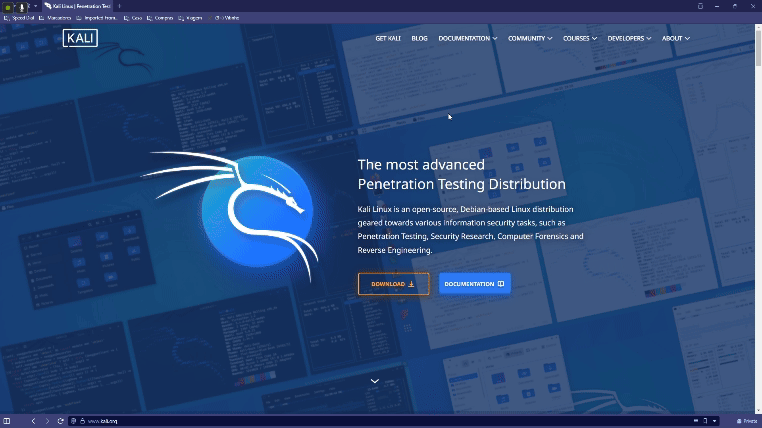
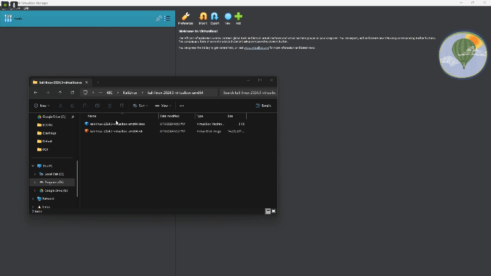
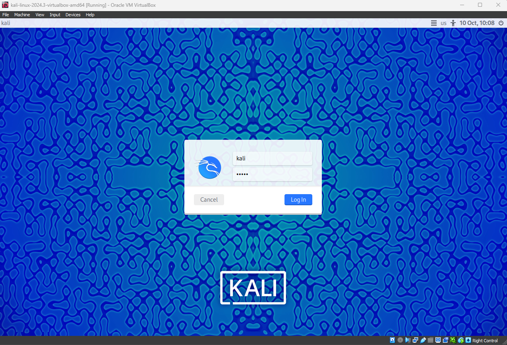

# Guia de Instalação: Kali Linux no Vbox

# O que é Kali Linux?

O **Kali Linux** é uma distribuição do sistema operacional Linux baseada no **Debian**, projetada especialmente para testes de penetração, análise forense digital e auditoria de segurança de redes e sistemas. Ele é amplamente utilizado por profissionais de segurança cibernética e hackers éticos (ou "white hats") devido à sua vasta coleção de ferramentas de segurança e hacking.

A principal característica do Kali Linux é que ele vem pré-configurado com uma enorme quantidade de ferramentas voltadas para **segurança da informação**, como scanners de vulnerabilidades, sniffers de rede, ferramentas de análise forense, e softwares para realizar testes de penetração (pentests). Essas ferramentas permitem que os usuários identifiquem e explorem falhas de segurança em sistemas, redes e aplicativos.

# Como Instalar?

1. Acesse o site: [https://www.kali.org](https://www.kali.org/) e clique em “DOWNLOAD”.
2. Na parte de escolhas, selecione a opção: “Virtual Machines”
3. Selecione a Opção “VirtualBox” e baixe o arquivo .7z



1. Extraia o arquivo, você terá acesso a uma pasta com outros dois arquivos dentro: um .vbox(Arquivo de virtualização do VirtualBox) e outro .vdi(Virtual Disk Image - Arquivo que armazena o HD virtual da sua máquina).
2. Jogue o arquivo .vbox dentro do Virtual Box para ele importar a máquina no Software
3. Inicie o Kali



1. Aguarde o Kali iniciar, ele pedirá login e senha:
    
    Login: kali
    
    Senha: kali
    



1. Pronto! Agora não se esqueça de atualizar os pacotes para manter seu sistema em dia!
    
    Comandos:
    
    ```bash
    sudo apt update && sudo apt upgrade
    ```
    
2. Caso prefira, mude as configurações da máquina para ter mais RAM alocada e mais núcleos do seu processador focados em trazer a melhor experiência com a máquina virtual, quanto mais potente a sua máquina, mais desempenho você terá na sua máquina virtual, se editar as configurações.