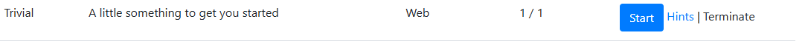
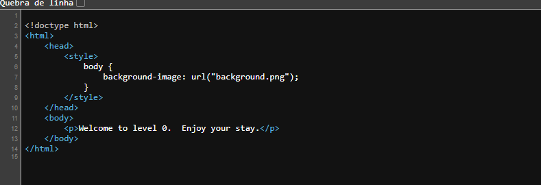
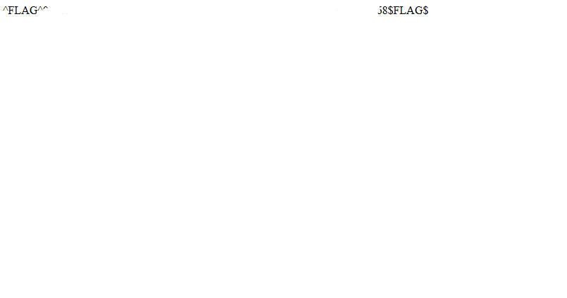

# Write-Up: A little something to get you started
> CTF: Hacker101\n
> Dificuldade: Trivial
> Categoria: Web
> Nº de Flags: 1
---

## Iniciando a máquina:
Vamos iniciar a máquina clicando no botão **"Começar" (Start).**

## Flag 0:

1. Quando iniciada, você será redirecionado para a seguinte tela:

2. Não conseguimos nenhuma informação aparentemente, a url não apresenta nada fora do normal e o site é apenas um 
 com o fundo branco, vamos ver se tem algo escondido no código fonte:

3. Estranho... Aqui podemos ver que o header do site tem uma tag de estilo, que define uma imagem (background.png) como plano de fundo.

4. Vamos ver o que essa imagem retorna:

5. Bingo! Conseguimos a flag necessária para completar o desafio!

## Por que isso acontece?

No mundo real, imagens podem ser cortadas via código para caberem em um elemento específico dentro do site, o problema é que em alguns casos, o desenvolvedor pode "ocultar" uma informação importante da imagem encaixando-a nesse elemento, já que o usuário comum não teria acesso a este conteúdo. 

